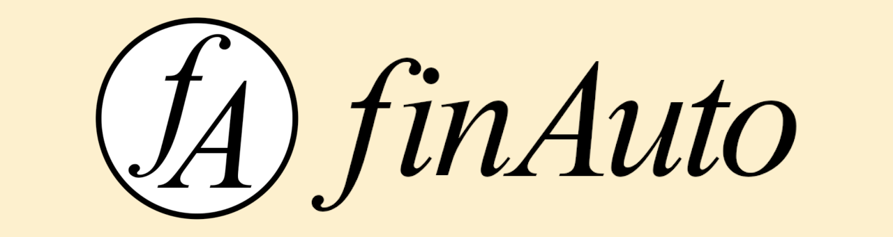

# finAuto - a Finite Automata Simulator

### Features

- DFA and NFA creation
- DFA and NFA stepwise simulation
- NFA to DFA conversion via the powerset construction
- Regular expression to NFA conversion via Thompson's algorithm
- NFA to regular expression conversion via Kleene's algorithm

### License

This software uses the [pixi.js](https://github.com/pixijs/pixi.js) graphics library, which is licensed under the MIT License.

This software is released under the MIT License.